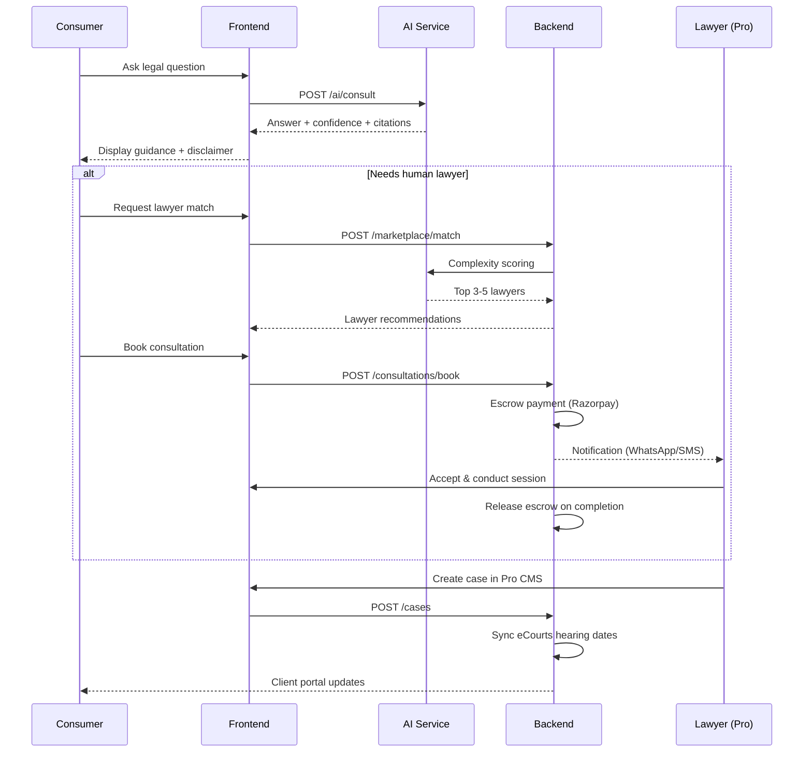

# VakilAI BRD — Architecture, Orchestration & Workflow

> **Team:** Platform Engineering, DevOps, Solution Architects, Tech Leads  
> **Related docs:** [Frontend](./02_Frontend.md) · [Backend](./03_Backend.md) · [AI](./04_AI.md)

---

## 1. Executive Summary

VakilAI is a next-generation Legal AI Platform for the Indian legal ecosystem — a dual-sided marketplace where citizens and businesses get instant, affordable legal assistance, and lawyers get AI-powered productivity tools.

**Mission:** Democratize access to justice in India by combining AI with human legal expertise — making legal help instant, affordable, and accessible while empowering lawyers to work smarter.

### Market Opportunity

| Metric | Value |
|--------|-------|
| India Legal AI Market (2024) | USD 29.5M |
| India Legal AI Market (2030) | USD 106.3M |
| CAGR (2025–2030) | 23% |
| Pending Court Cases | 50+ Million |
| Lawyers in India | ~1.5 Million |

---

## 2. Product Architecture

### 2.1 Three Product Layers

| Layer | Target User | Core Value |
|-------|-------------|------------|
| **VakilAI Assistant** (AI Chatbot) | Citizens, Individuals, SMEs | Instant AI legal advice, document generation, rights awareness |
| **VakilAI Connect** (Lawyer Marketplace) | Clients seeking lawyers | Find, vet & consult verified lawyers — AI-matched or manual |
| **VakilAI Pro** (Lawyer Productivity Suite) | Lawyers & Law Firms | AI research, document drafting, case management, CRM, billing |

All three layers are interconnected. A client starting with the AI chatbot can escalate to a human lawyer via Connect. A lawyer using Pro manages the same client in their dashboard.

### 2.2 Platform Architecture Overview

Cloud-native **microservices** architecture deployed as web + mobile (Android + iOS):

```
┌─────────────────────────────────────────────────────────────────┐
│                     Client Layer                                 │
│         Web (Next.js)  │  Mobile (React Native)  │  WhatsApp    │
└────────────────────────────┬────────────────────────────────────┘
                             │
┌────────────────────────────▼────────────────────────────────────┐
│                   API Gateway / BFF Layer                        │
│              (Auth, Rate Limiting, Routing)                      │
└──┬──────────────┬──────────────┬──────────────┬─────────────────┘
   │              │              │              │
┌──▼──┐      ┌────▼────┐    ┌────▼────┐    ┌────▼────┐
│User │      │Market-  │    │Practice │    │ AI      │
│Svc  │      │place Svc│    │Mgmt Svc │    │ Service │
└──┬──┘      └────┬────┘    └────┬────┘    └────┬────┘
   │              │              │              │
┌──▼──────────────▼──────────────▼──────────────▼─────────────────┐
│              Data & Integration Layer                            │
│  PostgreSQL │ MongoDB │ S3 │ Pinecone/Weaviate │ External APIs   │
└─────────────────────────────────────────────────────────────────┘
```

### 2.3 Technology Pillars

| Pillar | Technology | Owner |
|--------|------------|-------|
| LLM Core | Claude API + Fine-tuned LLaMA (Indian Legal) | AI Team |
| NLP / Multilingual | English, Hindi + 8 regional languages | AI Team |
| Vector Database | Pinecone / Weaviate — 4M+ judgments | AI Team |
| Document AI | AWS Textract + Custom ML | AI Team |
| Predictive Analytics | Litigation outcome prediction | AI Team |
| Primary DB | PostgreSQL | Backend Team |
| Document Store | MongoDB + S3 (ap-south-1) | Backend Team |
| Orchestration | AWS EKS (Kubernetes) + GitHub Actions | Platform Team |
| Observability | Datadog + Sentry | Platform Team |

### 2.4 Full Technology Stack

| Layer | Technology | Rationale |
|-------|------------|-----------|
| Frontend (Web) | React.js + Next.js | SEO-friendly SSR |
| Mobile App | React Native | Single codebase |
| Backend API | Node.js + Python (FastAPI) | Node for REST, Python for AI/ML |
| AI / LLM | Anthropic Claude + Fine-tuned LLaMA | Reasoning + Indian legal training |
| Vector Search | Pinecone / Weaviate | Semantic case law search |
| Database (Primary) | PostgreSQL | ACID compliance |
| Database (NoSQL) | MongoDB | Flexible schema for documents |
| File Storage | AWS S3 (ap-south-1) | Data localization |
| Video Calls | Twilio / Agora | Encrypted consultations |
| Payments | Razorpay | UPI, India payments |
| OCR | AWS Textract + Custom ML | Indian document parsing |
| Notifications | AWS SES + SNS + WhatsApp Business API | Multi-channel alerts |
| DevOps | AWS EKS + GitHub Actions | Container orchestration |
| Monitoring | Datadog + Sentry | Full-stack observability |

---

## 3. Core User Workflows (Orchestration)

### 3.1 Consumer Journey: AI → Lawyer → Case



### 3.2 Lawyer Journey: Onboard → Research → Manage

1. **Onboard** — Bar Council verification → DigiLocker identity → profile creation
2. **Research** — Semantic search → precedent finder → research memo generation
3. **Draft** — Template selection → AI auto-fill → co-drafting → version history
4. **Manage** — Case dashboard → hearing tracker → client CRM → billing

### 3.3 Cross-Service Event Flow

| Event | Publisher | Subscribers | Action |
|-------|-----------|-------------|--------|
| `consultation.booked` | Marketplace Svc | Notification Svc, Payment Svc | Hold escrow, notify lawyer |
| `consultation.completed` | Marketplace Svc | Payment Svc, CRM Svc | Release payment, update client record |
| `case.hearing.updated` | Practice Mgmt Svc | Notification Svc | SMS/WhatsApp reminder to lawyer + client |
| `document.generated` | AI Svc | Storage Svc, User Svc | Save to S3, update user quota |
| `statute.amended` | AI Svc (tracker) | Notification Svc | Alert subscribed lawyers |

---

## 4. Stakeholders & Personas

### 4.1 Primary Stakeholders

| Stakeholder | Role | Platform Interaction |
|-------------|------|---------------------|
| Individual Citizen | End Consumer | AI consultation, document generation, lawyer matching |
| SME / Startup | Business Consumer | Contract review, compliance, retainer management |
| Solo Practitioner | Supply Side | AI research, case management, CRM |
| Law Firm (10–100) | Enterprise B2B | Full Pro suite, team collaboration, billing |
| In-House Legal Counsel | Corporate User | Contract lifecycle, compliance monitoring |
| Legal Aid Organizations | Institutional Partner | Pro bono matching, case distribution |

### 4.2 Secondary Stakeholders

- Bar Council of India & State Bar Councils — lawyer verification
- Court Systems (eCourts API) — case status tracking
- Insurance Companies — legal expense insurance
- Banks & NBFCs — document verification
- Law Schools — student learning tools

### 4.3 Key Personas

**Priya Mehta** (Consumer, Pune) — Wrongful termination; needs rights guidance + affordable lawyer via Connect.

**Advocate Ramesh Kumar** (Solo, Lucknow) — Spends 4–5 hrs/day on research; needs Pro suite to cut time 70%.

**Nexus Ventures** (Startup, Bengaluru) — Needs contract review without full-time counsel; uses Business Plan.

---

## 5. Non-Functional Requirements (Platform-Wide)

| Category | Requirement | Target |
|----------|-------------|--------|
| Performance | API response time for AI queries | < 3s (P95) |
| Performance | Document generation time | < 10s |
| Scalability | Concurrent users | 100,000+ |
| Availability | Platform uptime | 99.9% SLA |
| Security | Encryption | AES-256 at rest, TLS 1.3 in transit |
| Security | Authentication | MFA + OTP + Biometric (mobile) |
| Compliance | Data localization | India-based servers (DPDP 2023) |
| Compliance | Advocate verification | Bar Council API integration |
| Accessibility | Languages | English + Hindi + 8 regional |
| Accessibility | Devices | Web, Android, iOS |
| Privacy | Attorney-client privilege | E2E encryption on lawyer-client comms |
| AI Safety | Hallucination mitigation | Source citation mandatory |

---

## 6. Regulatory & Compliance (Cross-Cutting)

| Regulation | Applicability | Action |
|------------|---------------|--------|
| Advocates Act, 1961 | Who can practice law | AI is information tool; advice attributed to verified advocate |
| Bar Council Rules | Lawyer advertising | Profiles comply with BCI standards |
| DPDP Act, 2023 | Data privacy | Data localization, consent, DPO, breach notification |
| IT Act, 2000 | Cybersecurity | E-signed docs valid; secure storage; audit |
| Consumer Protection Act, 2019 | Platform liability | Grievance redressal, 30-day refund, nodal officer |
| BNS 2023 | New criminal code | AI corpus includes BNS, BNSS, BSA |
| GST Act | Digital services tax | GST registration, TDS, compliant invoicing |
| RBI Payment Guidelines | Escrow rules | Razorpay PA compliance; escrow with SCB |

### AI Ethics Policy (Platform-Level)

- Disclaimer on every AI output
- Hallucination prevention: cite source judgment/statute; block uncited responses
- Quarterly bias audits (gender, religion, caste, socioeconomic)
- Human oversight for high-stakes matters (criminal, bail, adoption)
- Explainability: lawyers see cases/statutes used in research outputs

---

## 7. Service Boundaries & API Contracts

### 7.1 Microservice Ownership

| Service | Owner | Responsibilities |
|---------|-------|------------------|
| `user-service` | Backend | Auth, profiles, MFA, subscriptions |
| `marketplace-service` | Backend | Lawyer profiles, matching, consultations, escrow |
| `practice-mgmt-service` | Backend | CMS, CRM, billing, task management |
| `ai-service` | AI | Consultation, document gen, research, RAG |
| `notification-service` | Backend | SMS, WhatsApp, email, push |
| `integration-service` | Backend | eCourts, Bar Council, DigiLocker, Razorpay |
| `document-service` | Backend | S3 storage, OCR pipeline triggers |

### 7.2 Inter-Team API Handoff Points

| Endpoint Pattern | Producer | Consumer | SLA |
|----------------|----------|----------|-----|
| `POST /ai/consult` | AI | Frontend, Backend | < 3s P95 |
| `POST /ai/documents/generate` | AI | Frontend | < 10s |
| `POST /ai/research/search` | AI | Frontend (Pro) | < 5s |
| `POST /marketplace/match` | Backend (+ AI scoring) | Frontend | < 30s |
| `GET /cases/{id}/hearings` | Backend (eCourts sync) | Frontend | < 1s |
| `POST /payments/escrow` | Backend | Frontend | < 2s |

---

## 8. Implementation Roadmap

| Phase | Timeline | Key Deliverables | Success Metric |
|-------|----------|------------------|----------------|
| Phase 0: Foundation | Month 1–2 | Architecture design, corpus licensing, BCI review | 20 engineers onboarded |
| Phase 1: AI Core | Month 2–4 | AI engine, 50 doc templates, lawyer portal, basic CMS | 85% Q&A accuracy |
| Phase 2: MVP Launch | Month 4–6 | Consumer web + Android, Connect live, Pro beta, payments | 500 lawyers, 5K signups |
| Phase 3: Growth | Month 7–12 | Full Pro suite, eCourts API, Hindi + 2 regional langs | 10K paying users, ₹1 Cr MRR |
| Phase 4: Scale | Month 13–24 | All 10 languages, 25 practice areas, API licensing | 1L users, ₹5 Cr MRR |
| Phase 5: Leadership | Month 25–36 | Court transcription, predictive analytics 2.0, govt partnerships | 5L users |

### Go-To-Market Phases

**Phase 1 (M1–6):** Delhi-NCR, Mumbai, Bengaluru, Hyderabad — Property, Family, Consumer Rights — 500 lawyers.

**Phase 2 (M7–18):** 15+ cities, 8 practice areas, regional languages, B2B enterprise, NALSA partnership, eCourts integration.

**Phase 3 (M19–36):** Pan-India, API licensing, law school product, legal insurance marketplace.

---

## 9. Team Structure (Year 1)

| Function | Count |
|----------|-------|
| Leadership (CEO, CTO, CPO, CLO) | 4 |
| AI / ML Engineering | 6 |
| Backend Engineering + DevOps | 6 |
| Frontend / Mobile | 4 |
| Legal Operations | 4 |
| Product & Design | 4 |
| Sales & Marketing | 5 |
| Customer Support | 4 |

**Seed Capital:** ₹9.5–12 Cr (~$1.1M USD)

---

## 10. Risk Register (Architecture-Relevant)

| Risk | Probability | Impact | Mitigation |
|------|-------------|--------|------------|
| AI incorrect advice | Medium | High | Lawyer review for high-risk; disclaimers; insurance |
| BCI unauthorized practice classification | Medium | High | Legal opinion; AI as information tool |
| Data breach | Low | Critical | E2E encryption, pen testing, cyber insurance |
| LLM hallucination | Medium | High | RAG, mandatory citations, confidence thresholds |
| Regulatory AI restrictions | Low | High | Compliance-first design; BCI engagement |

---

## 11. KPIs (Platform-Level)

| KPI | Year 1 | Year 3 |
|-----|--------|--------|
| AI Query Accuracy | 85% | 93% |
| Document Generation Success | 95% | 99% |
| Time to Lawyer Match | < 30s | < 10s |
| Consultation Completion Rate | 80% | 90% |
| MAU | 25,000 | 5,00,000 |
| MRR | ₹50 Lakhs | ₹6 Crore |

---

## 12. Glossary

| Term | Definition |
|------|------------|
| BNS / BNSS / BSA | New Indian criminal codes (2023) |
| BCI | Bar Council of India |
| DPDP | Digital Personal Data Protection Act 2023 |
| eCourts | Govt ICT-enabled courts project |
| RAG | Retrieval-Augmented Generation |
| NALSA | National Legal Services Authority |

---

*Source: VakilAI_BRD.docx v1.0 — Sections 1–4, 6–7, 10–16 (architecture-relevant)*
